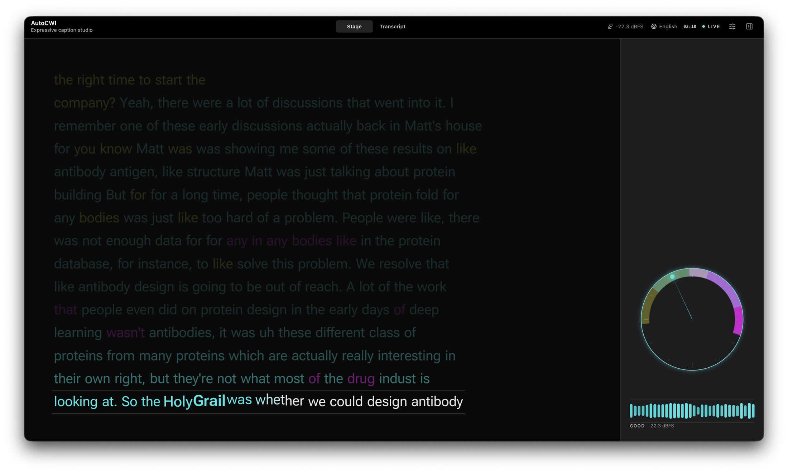

# Weave

[](https://www.python.org/)
[](https://github.com/k2-fsa/sherpa-onnx)
[](https://nextjs.org/)

[Project Page](https://nobel2040ne.github.io/Weave/)

Live speech into expressive captions for Deaf and hard-of-hearing viewers, automating [Caption with Intention](https://captionwithintention.org): colour for who is speaking, motion for when each word is spoken, a variable font for how it is said. English or Korean, entirely offline.



## Quick start

Python 3.11, Node.js and ffmpeg, on macOS (Apple Silicon) or Linux.

```bash
python3.11 -m venv .venv
.venv/bin/pip install -r requirements.txt
.venv/bin/python scripts/fetch_font.py             # fonts, ~12 MB
.venv/bin/python scripts/fetch_streaming_model.py  # models, ~2.2 GB
npm --prefix web install && npm --prefix web run build
.venv/bin/python -m autocwi live --sample          # opens 127.0.0.1:7337
```

`fetch_streaming_model.py` takes `--korean-only`, `--speaker-only`, `--sortformer-only` and `--onset-only` for a partial download. Korean motion needs the font step — Roboto Flex has no Hangul outlines.

First run loads models for ~8 s. macOS asks for microphone permission once per terminal app. A page stuck on *Preparing language setup* means `web/out` is stale.

## Commands

Live — the product. Language is locked before capture.

```bash
.venv/bin/python -m autocwi live                   # microphone; pick a language first
.venv/bin/python -m autocwi live --lang ko         # en, ko, or multi (both at once)
.venv/bin/python -m autocwi live --list-devices    # choose a microphone
.venv/bin/python -m autocwi live --sample          # the bundled film, no microphone
.venv/bin/python -m autocwi live --file talk.wav   # stream a file at real-time pace
.venv/bin/python -m autocwi live --diarizer off    # captions without speaker colour
```

`cc` — a finished spec, at exact reference motion.

```bash
.venv/bin/python -m autocwi cc assets/reference_specs/demo.json
.venv/bin/python -m autocwi cc out/spec.json --media clip.mp4   # beside the video
.venv/bin/python -m autocwi tune                                # adjust motion by hand
```

Offline — recorded media to `spec.json`.

```bash
.venv/bin/python -m autocwi run clip.mp4 --out out/ --stub      # no models, runs anywhere
.venv/bin/python -m autocwi run clip.mp4 --out out/ --speakers 2
```

Whisper downloads on first use. Diarization reads `HF_TOKEN`; pyannote's weights are gated on [speaker-diarization-3.1](https://huggingface.co/pyannote/speaker-diarization-3.1) and [segmentation-3.0](https://huggingface.co/pyannote/segmentation-3.0). Inference stays local.

Wearable — a ReSpeaker mic array and a motor ring on a Raspberry Pi Zero 2 W.

```bash
# on the Pi, once
sudo apt install -y python3-numpy python3-gpiozero git libportaudio2 python3-cffi
pip install --break-system-packages sounddevice pyusb    # neither is packaged on trixie

# on the Pi
sudo python3 scripts/hw/probe_array.py --skip-audio # USB needs root to read interface names
python3 scripts/hw/probe_motor.py --wiring         # prints the driver circuit, touches no pin
python3 scripts/hw/probe_motor.py --gpio 4         # buzz one motor
python3 scripts/hw/weave_node.py --host MAC_IP     # stream audio + bearing to the Mac

# on the Mac
.venv/bin/python -m autocwi live --node --host 0.0.0.0
```

The ring follows the array's bearing; `--mac-cues` switches it to the Mac's cues. The server binds `127.0.0.1:7337`; `--host` widens it to the LAN.

## Map

```
autocwi/     the runtime: live engine, offline pipeline, renderers, schema
web/         the studio UI; static-exported and served by Python
native/      Swift helper for diarization on Apple Silicon
scripts/     one-time downloads; the Raspberry Pi node
assets/      fonts, sample audio, reference specs
config.yaml  every tunable value — never hardcoded in code
```

## Documentation

| | |
|---|---|
| [nobel2040ne.github.io/Weave](https://nobel2040ne.github.io/Weave/) | the project, on one page |
| [ARCHITECTURE.md](ARCHITECTURE.md) | modules, data contract, glossary |
| [CONTRIBUTING.md](CONTRIBUTING.md) | setup and the ground rules |
| [web/README.md](web/README.md) | the studio frontend |
| [captionwithintention.org](https://captionwithintention.org) | the design system — the final word |

## Future work

- **Read-ahead costs 1.75 s of latency.** `cc` is exact because it knows the text in advance.
- **Attribution at the edges** — short turns and similar voices stay ambiguous.
- **A locked session.** `--lang multi` hears both; `en` and `ko` hold one model.
- **Unimplemented from the spec:** off-camera italics, the sound-effect and music caption rules, and the ring on the live lane.

## License

MIT — see [LICENSE](LICENSE). Caption with Intention is authored by the Chicago Hearing Society; this is an independent implementation, not affiliated with or endorsed by them. Bundled samples, model weights and fonts carry their own licenses.
